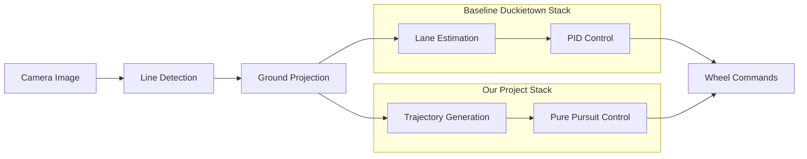
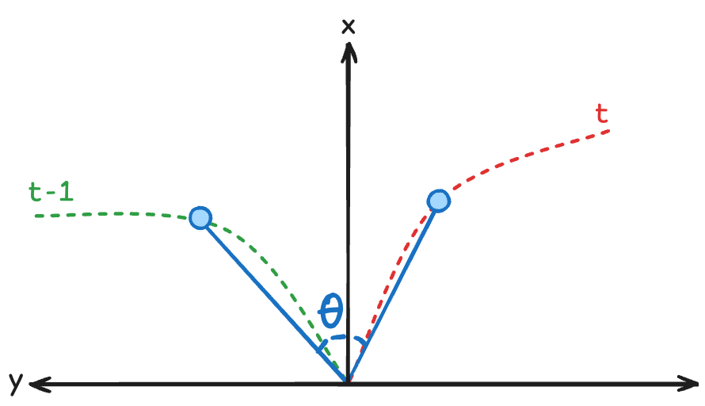
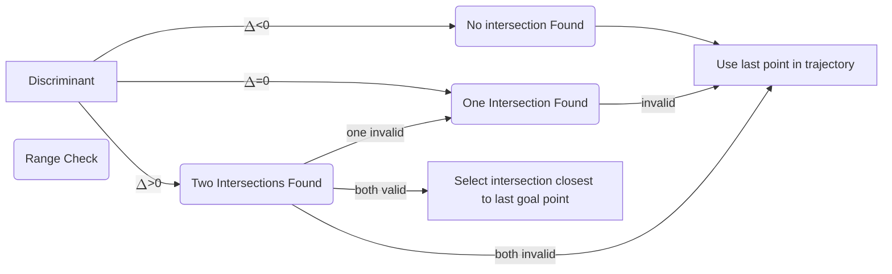
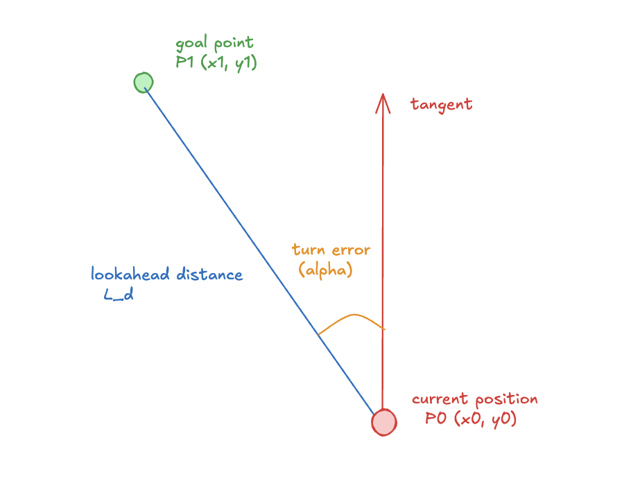

# Lane Following using Pure Pursuit Control
Emulie Chhor, Kumaraditya Gupta
2025-12-31

## Introduction

This project implements lane following on a Duckiebot using trajectory
generation and pure pursuit control. The standard Duckietown
lane-following stack estimates lane pose $(d, \phi)$ via a histogram
filter and applies a PID controller on that estimate. In practice, the
$(d, \phi)$ measurement can be noisy and discontinuous. Especially under
partial occlusions, sparse lane markings, or during turns, which leads
to jittery steering and reduced driving smoothness.

Instead of using $(d, \phi)$, we use perception output (ground-projected
lane segments) directly for local path construction. At each time step,
we generate a **centerline trajectory in the robot frame**, apply
temporal smoothing, and track the resulting path using **pure pursuit
control**. This replaces explicit lane-state estimation with a
path-tracking formulation: control commands are computed directly from
the local trajectory, yielding smoother driving through curves.

The baseline stack consists of:

- **Line detection:** color segmentation (white/yellow/red), edge
  detection (Canny), and line extraction (Hough) to produce lane-marker
  segments in the image.
- **Ground projection:** homography-based mapping from image coordinates
  to the ground plane using camera calibration.
- **Lane estimation:** a histogram filter over $(d, \phi)$ that fuses a
  kinematic prediction with segment-based updates.
- **Control:** PID-style steering using the estimated $(d, \phi)$,
  typically with constant forward velocity and angular correction based
  on lateral and heading error.

We keep **line detection** and **ground projection**, but replace the
downstream modules:

- **Trajectory generation:** compute a forward centerline path from
  projected segments, with robust fitting and temporal smoothing.
- **Pure pursuit control:** select a lookahead goal point on the path
  and compute curvature/steering commands to track it.



Over this project we set and achieved these three goals:

1.  Trajectory generation from detected lane segments, including
    temporal smoothing for stability.
2.  Pure pursuit control on the generated trajectory.
3.  Demonstrate continuous looped driving on a real Duckiebot in the lab
    Duckietown.

## Trajectory Generation

This module uses ground-projected lane detections in the robot frame:
white points $\mathcal{W}={(x_i,y_i)}$ and yellow points
$\mathcal{Y}={(x_j,y_j)}$, where $x$ is forward distance and $y$ is
lateral offset. The goal is to output a local centerline trajectory
$\Gamma={(x_k, y_k)}_{k=1}^{N}$ over a fixed horizon
$x_k \in [0, \texttt{max\_forward}]$, suitable for pure pursuit. In
practice, the key challenge is that the point sets are noisy (mainly due
to false detections), so the trajectory generator must be robust and
temporally stable.

### Methods explored but discarded

**1) Midpoint pairing heuristic.** We first attempted to construct the
centerline by pairing boundary points and taking midpoints. Concretely,
for each detected yellow point we found the nearest white point and
defined the midpoint of the pair as a centerline sample. This fails on
real hardware because white detections frequently “bleed” onto the
yellow marker (e.g., due to lighting and segmentation artifacts). As a
result, nearest-neighbor pairing becomes unreliable: midpoints drift
toward a boundary and jump between inconsistent pairings across frames.
The downstream fit then produces trajectories that are not
representative of the lane center.

**2) Bézier fit + normal shift.** We also tried fitting a Bézier curve
to lane detections and shifting it inward by half the lane width using
the curve normal. While geometrically appealing, this approach is
brittle because the Bézier fit tends to be strongly influenced by
individual detections. With sparse or noisy points, a single outlier can
significantly change the curve shape, again producing unreliable
trajectories and also with large frame-to-frame variations.

### Final approach: polynomial fitting with RANSAC

What worked reliably was a robust polynomial fit in the ground plane,
using RANSAC to reject outliers.

1.  Choose which boundary to fit. In our experiments, fitting on white
    points was most stable (more consistent and typically more
    numerous). We default to $\mathcal{W}$, and switch to $\mathcal{Y}$
    only when there are insufficient white detections.

> [!CAUTION]
>
> ### White Point Filtering
>
> Because the system is configured for right-hand driving, we sometimes
> detect white points from the adjacent (left) lane boundary. To prevent
> mixing these into the fit, we discard white points that lie too far to
> the left (beyond roughly half a lane width). This simple geometric
> filter significantly reduced “lane switching” behavior in the fitted
> curve.

2.  Fit a polynomial model robustly. We fit $y(x)$ as a quadratic
    polynomial and use RANSAC so that spurious points (from floor,
    glare, or wrong-color detections) do not dominate the model.
    Intuitively, RANSAC repeatedly fits the curve to small random
    subsets and keeps the hypothesis that agrees with the largest set of
    points. Once these inliers are identified, the final curve is fit on
    all the inliers to ensure maximum accuracy. This gives a curve that
    follows the dominant lane boundary even when the input is noisy.

3.  Convert boundary curve to centerline. Once we have a clean boundary
    curve, we compute the local normal direction along the curve and
    shift laterally by half the lane width to obtain the centerline.

4.  Sample a fixed-horizon trajectory. We uniformly sample $N$ points in
    $x$ from $0$ to $\texttt{max\_forward}$ and evaluate the centerline
    model to produce the final trajectory points $(x_k,y_k)$. This
    produces a consistent representation for pure pursuit (same number
    of points, same horizon, every frame).

### Temporal buffering for smoothness and consistency

A good single-frame trajectory is not enough as pure pursuit can be
sensitive to frame-to-frame trajectory jumps, which show up as steering
jitter. We therefore stabilize the trajectory over time with two
mechanisms:

**1) Reject implausible trajectory flips.** We compute a simple “heading
proxy” from the trajectory midpoint (a point around the middle of the
horizon). If the direction from the robot to this midpoint changes by
more than a threshold $\theta_{\text{thresh}}$ compared to the previous
frame, we treat the current trajectory as unreliable and reuse the
previous one. An example of the $\theta$ computation is also shown in
<a href="#fig-theta" class="quarto-xref">Figure 1</a>. This catches
cases where the fit snaps to the wrong structure for a frame (common
under sparse or false detections).

<div id="fig-theta">



Figure 1: Heading change calulcation between the current and previous
trajectory

</div>

**2) Exponential smoothing of the lateral profile.** When a trajectory
is accepted, we still smooth it to reduce high-frequency noise: $$
y^{\text{sm}}_{t} = \alpha*y_{t} + (1-\alpha)*y^{\text{sm}}_{t-1},
$$

applied pointwise across the sampled trajectory. The parameter $\alpha$
controls responsiveness vs. smoothness. This simple filter substantially
reduces steering jitter while preserving curvature for cornering within
the short planning horizon.

Overall, this pipeline produces a locally defined, robust, and
temporally stable centerline trajectory from ground-projected lane
points, which is then tracked by pure pursuit.

The code for trajectory generation can be found
[here](https://github.com/kumaradityag/fp-control/blob/628538e81f2285e2fee654630a9204dcadac7b19/packages/trajectory_planner/include/trajectory_generation.py#L107)

## Pure Pursuit Control

The second part of the project focused on enhancing the controller node
using the “Pure Pursuit” algorithm, which enables the robot to adjust
its path before the error accumulates. Similar to PID control, pure
pursuit is a steering method that computes the linear (v) and angular
velocity ($\omega$). However, instead of relying on the cross-track
error (CTE), the lateral distance between the vehicle and the
centerlane, it relies on the pre-computed trajectory as a reference.

The pure pursuit controller consists of two keys steps:

1.  Goal Point Computation: We determine the goal point to which the
    robot aims to reach
2.  Control Commands Computation: We compute the linear and angular
    velocity required to make the duckie reach the computed goal point


If you are familiar with the “follow the carrot” analogy, pure pursuit
control works fashionably in the same way: we make the robot (the
donkey) move towards the goal point (the carrot), which we always keep
at a distance $L_d$, the lookahead distance. If the donkey is too far
from the goal point, we “stick” it to the robot and make it turn more
aggressively towards the goal point.

<https://youtu.be/-PVFBGN_zoM?si=9V-fbQ8J0mmzbZtT>

### Goal Point Calculation - Line-circle intersection algorithm

Many methods can be used to compute the goal point, but we decided to go
with the “line-circle intersection” algorithm for its computational
simplicity.

Mathematically speaking, the line-circle intersection algorithm tries to
find the points where a straight line intersects the circle with radius
R.

> [!NOTE]
>
> ### Understanding the maths behind the line-circle intersection algorithm
>
> Given a circle centered at the origin with radius r and points P1(x1,
> y1) and P2(x2, y2). The implicit line equation for the closed-form
> geometry can be written as
>
> $$ d_y x - d_x y + D = 0$$
>
> where
>
> - $D=x_1 y_2 - x_2 y_1$
> - $d_x = x_2 - x_1$
> - $d_y = y_2 - y_1$
>
> The perpendicular projection of the origin onto the line is:
>
> $$
> \begin{aligned}
> x_0 &= \frac{D d_y}{d_r^2} \\
> y_0 &= \frac{-D d_x}{d_r^2}
> \end{aligned}
> $$
>
> where $dr= \sqrt{dx^2 + dy^2}$
>
> Since the closest point from the origin to the line is a perpendicular
> projection, we can determine the existence of the intersection using
> the distance from the origin to the line
>
> $$\text{dist} = \frac{|D|}{d_r}$$
>
> - If dist \> r, there are no intersection
> - If dist = r, one tangent intersection
> - If dist \< r, there are two intersections
>
> From the right-triangle geometry, we can find the distance along the
> line from the closest point to each intersection, which we can use to
> move from the closest point forward and backward along the line
>
> $$h = \sqrt{r^2 - \left(\frac{D}{d_r}\right)^2}$$
>
> The unit direction along the line is given by
>
> $$\hat{\mathbf{u}} = \left( \frac{d_x}{d_r}, \frac{d_y}{d_r} \right)$$
>
> This gives us the formula to compute the intesection points
>
> $$
> \mathbf{P}_{1,2}
> =
> \begin{pmatrix}
> x_0 \\
> y_0
> \end{pmatrix}
> \pm
> h \,\hat{\mathbf{u}}
> $$
>
> $$
> \begin{aligned}
> x &= \frac{D d_y \pm d_x \sqrt{r^2 d_r^2 - D^2}}{d_r^2} \\
> y &= \frac{-D d_x \pm d_y \sqrt{r^2 d_r^2 - D^2}}{d_r^2}
> \end{aligned}
> $$

Since the line-circle intersection method works for two points only and
the trajectory is an array of points, given two consecutive trajectory
points P1(x1, y2) and P2(x2, y2), the goal point P(x, y) can be found as
follows:

- $x=\frac{D dy \pm sgn(dy) dx \sqrt{\Delta}}{L_d^2}$
- $y=\frac{-D dx \pm \| dy \| \sqrt{\Delta}}{L_d^2}$

Where

- $dx=x_2-x_1$
- $dy=y_2-y_1$
- $dr= \sqrt{dx^2 + dy^2}$
- $D=x_1 y_2 - x_2 y_1$
- $\Delta=r^2 dr^2 - D^2$
- $f(x) = \begin{cases} 0, & x<0 \\ x, & x\ge 0 \end{cases}$

To determine the validity of the goal point computed, we can follow the
following graph:



Essentially, we compute the discriminant $\Delta$ to find valid
intersections. The intersection we find is valid if $\Delta \ge 0$ and
if it’s between the trajectory segment points.

The full implementation can be found inside the function
[find_goal_point()](https://github.com/kumaradityag/fp-control/blob/e145767ec9b8fbaf04f0cfd550c42bd7930a55fd/packages/pure_pursuit_control/include/pure_pursuit_controller/goal.py#L13)

### Control Command Computation - “Follow the carrot” approach

The first implementation of pure pursuit that we coded kept the linear
velocity constant and only accounted for the angular velocity, which was
calculated using the turn error between the robot heading and the goal
point.

We define 3 parameters:

- `lookahead_distance`: Circle radius at which the duckiebot sees
- `kp_steering`: How hard do we want to steer the wheel upon turn error
- `v_bar`: Linear velocity

Consider the following picture,



The turn error can be computed

$$\alpha = tan(\frac{y_1-y_0}{x_1 - x_0})$$

Thus,

$$\omega = \text{kp\_sterring} \cdot \alpha$$

The code for the “follow the carrot” approach looks something like this:

``` python
goal_point, _ = find_goal_point(
    path_points,
    self.current_pos,
    lookahead_distance,
    self.last_found_index,
)
dx, dy = (
    goal_point[0] - self.current_pos[0],
    goal_point[1] - self.current_pos[1],
)
abs_target_angle = math.atan2(dy, dx)
turn_error = abs_target_angle - np.deg2rad(self.current_heading)
L_d = math.sqrt(dx**2 + dy**2)

v = v_bar
omega = kp_steering * turn_error
```

The full code implementation can be found in the function
[compute_control_action()](https://github.com/kumaradityag/fp-control/blob/e145767ec9b8fbaf04f0cfd550c42bd7930a55fd/packages/pure_pursuit_control/include/pure_pursuit_controller/pure_pursuit_controller.py#L23)

### Control Command Computation - Tangent approach

In order to improve the duckiebot performance around sharp corners, we
wanted to adjust the linear velocity and angle velocity based on
curvature. Similarly to how one would drive, we want our duckie to slow
down around corner and speed up on when it drives straight ahead. To do
so, we used a tangent based approach to find the curvature.

Consider the following picture:


Using trigonometry, we find that

$$R = \frac{L_d}{2 sin(\alpha)}$$

> [!NOTE]
>
> ### Deriving the radius formula
>
> As seen previously, given the current pos P0(x0, y0) and the goal
> point P1(x1, y1), the turn error $\alpha$ can be computed as
>
> $$\alpha = tan(\frac{y_1 - y_0}{x_1 - x_0})$$
>
> Since the goal point is at distance $L_d$ of the current position, the
> half-way point is at distance $\frac{L_d}{2}$ and thus
>
> $$R = \frac{\frac{L_d}{2}}{sin(\alpha)} = \frac{L_d}{2 sin (\alpha)}$$

The curvature $k$ is defined as the inverse of the radius of the arc we
want the duckie to travel. Because we want the linear velocity to be
inversely proportional to the curvature (the higher the curvature, the
lower the speed), we get the following formula for linear velocity

$$k = \frac{1}{R}$$ $$v = \bar{v} * \frac{1}{k} = \bar{v} * R$$

To derive the angular error, now consider the diagram below:


Assuming that the robot finishes the turn after time $\delta t$, we have
that the left side ($L_l$) and right side ($L_R$) of the duckie turn
with velocity

$$
\begin{aligned}
L_l
&=
(\text{linearVel} - \text{turnVel}) \cdot \Delta t
=
\left( R - \frac{W}{2} \right) \cdot (2 \cdot \text{turnError})
\\[6pt]
L_r
&=
(\text{linearVel} + \text{turnVel}) \cdot \Delta t
=
\left( R + \frac{W}{2} \right) \cdot (2 \cdot \text{turnError})
\end{aligned}
$$

Solving for turn velocity, we get that

$$
\frac{(\text{linearVel} - \text{turnVel}) \cdot \Delta t}
     {(\text{linearVel} + \text{turnVel}) \cdot \Delta t}
=
\frac{\left( R - \frac{W}{2} \right) \cdot (2 \cdot \text{turnError})}
     {\left( R + \frac{W}{2} \right) \cdot (2 \cdot \text{turnError})}
$$

$$
\frac{\text{linearVel} - \text{turnVel}}
     {\text{linearVel} + \text{turnVel}}
=
\frac{R - \frac{W}{2}}
     {R + \frac{W}{2}}
$$

$$
\left( R + \frac{W}{2} \right)\text{linearVel}
-
\left( R + \frac{W}{2} \right)\text{turnVel}
=
\left( R - \frac{W}{2} \right)\text{linearVel}
+
\left( R - \frac{W}{2} \right)\text{turnVel}
$$

$$
\text{turnVel}
=
\frac{W}{2R} \cdot \text{linearVel}
$$

And since
$R = \frac{\text{lookaheadDistance}}{2 \sin(\text{turnError})}$, the
turn velocity

$$ 
\boxed{
\text{turnVel}
=
\frac{W \sin(\text{turnError})}
     {\text{lookaheadDistance}}
\cdot \text{linearVel}
}
$$

Thus, our curvature-based pure pursuit approach uses 4 parameters:

- `width`: width of the duckiebot chassis
- `omega_factor`: how hard we want to turn the steering wheel, very
  similar to `kp_steering`
- `v_bar`: default velocity
- `v_bar_min`: minimal linear velocity
- `v_bar_max`: maximal linear velocity

``` python
dx, dy = (
    goal_point[0] - self.current_pos[0],
    goal_point[1] - self.current_pos[1],
)
abs_target_angle = math.atan2(dy, dx)
turn_error = abs_target_angle - np.deg2rad(self.current_heading)
L_d = math.sqrt(dx**2 + dy**2)

R = np.abs(L_d / (2.0 * np.sin(turn_error)))
v = np.clip(v_bar * R, v_bar_min, v_bar_max)
omega = omega_factor * (width * np.sin(turn_error) * v) / L_d
```

The full code can be found
[here](https://github.com/kumaradityag/fp-control/blob/main/packages/pure_pursuit_control/include/pure_pursuit_controller/pure_pursuit_controller.py#L23)

## Results

### Pure Pursuit - “Follow the carrot”

Althought this approach is quite simple, we found that it performed
relatively well with the right parameters. When driving at lower speed,
the duckiebot was able to turn the corner gracefully without too much
oscillation. However, as soon as we get it to drive a bit faster, it
wasn’t very good at turning around corners, especially in the inner lane
due to its sharp corners.

Outer Loop:

<iframe src="https://drive.google.com/file/d/1ga7rnIbhwDYizVIQUI2vUZ9cj6RG9D2b/preview" style="width: 100%; aspect-ratio: 16/9;" allow="autoplay; fullscreen; picture-in-picture" frameborder="0"></iframe>

Inner Loop:

<iframe src="https://drive.google.com/file/d/1YI_d33H-vBUEEcU9B2leVrXtq-WjtjrI/preview" style="width: 100%; aspect-ratio: 16/9;" allow="autoplay; fullscreen; picture-in-picture" frameborder="0"></iframe>

### Pure Pursuit - Tangent approach

With the tangent approach we can observe the duckiebot going faster on
the straights and slower around the corners. However this approach did
not produce strictly better results than the “follow the carrot”
approach. As after turning around the corner, the tangent approach
overcorrected way more than with the naive approach.

Some of these results can be explained because we changed the map on
which the duckie drove, which generated a worse trajectory than the test
we had generated prior.

Outer Loop:

<iframe src="https://drive.google.com/file/d/1pXbwknVJrbhRgPkGaJ3Z8cl9AH0PRWUk/preview" style="width: 100%; aspect-ratio: 16/9;" allow="autoplay; fullscreen; picture-in-picture" frameborder="0"></iframe>

Inner Loop:

<iframe src="https://drive.google.com/file/d/1dap8M6RoXJU4CMMKh4Rm86MiKA9e_1ej/preview" style="width: 100%; aspect-ratio: 16/9;" allow="autoplay; fullscreen; picture-in-picture" frameborder="0"></iframe>

### Trajectory Visualization

We also visualize the generated trajectory (shown in red points) along
with the detected white and yellow bouundries in the two videos below.

Trajectory Outer Loop:

<iframe src="https://drive.google.com/file/d/1F7V--gRNKAjZdDYyXZirzwYqiHWR51qc/preview" style="width: 100%; aspect-ratio: 2/1;" allow="autoplay; fullscreen; picture-in-picture" frameborder="0"></iframe>

Trajectory Inner Loop:

<iframe src="https://drive.google.com/file/d/1p1YS1dPKCC4cZ8kCuNYXfqpnl9Z63at6/preview" style="width: 100%; aspect-ratio: 2/1;" allow="autoplay; fullscreen; picture-in-picture" frameborder="0"></iframe>

## Testing

Testing instructions are also available in the README of the project
repository, [here](https://github.com/kumaradityag/fp-control). They are
also copied here for completeness.

To test the code, first clone the project GitHub repository.

``` bash
git clone git@github.com:kumaradityag/fp-control
```

These instructions assume you have the following:

- A duckietown-shell. You can verify that you have sucessfully installed
  it using `dts --version`. If that’s not the case, please follow the
  instructions
  [here](https://docs.duckietown.com/daffy/opmanual-duckiebot/setup/setup_laptop/setup_dt_shell.html)
- You have created your virtual duckiebot. You can verify that your
  virtual duckie exists with the command
  `dts duckiebot virtual start vbot` and then `dts fleet discover`.
  `vbot` is the name of our virtual duckie, but feel free to replace it
  with your own virtual duckie name
- You have your real life duckiebot setup. This step is only required if
  you want to test the demo in real life. If you want to get your duckie
  hardware, see the official documentation
  [here](https://docs.duckietown.com/daffy/opmanual-duckiebot/preliminaries_hardware/get_hardware/index.html)

### Understanding the project architecture

The most important directories of our projects are
`packages/trajectory_planner` and `packages/pure_pursuit_control`, which
are where our trajectory generation code and our pure pursuit code live.

Virtual and physical duckiebot can behave slightly differently because
of real-world physics, so they respond to the same parameters
differently. Additionally, in our current setup, driving in the inner or
outter lane also require different parameters. Therefore, you will
probably need to tune your parameters for your own duckiebot.

The configs for the trajectory planner and the pure pursuit controller
can be found respectively inside
`packages/trajectory_planner/config/trajectory_planner_node/default.yaml`
and
`packages/pure_pursuit_control/config/pure_pursuit_control_node/default.yaml`.
Additional config information is present at the bottom.

### Setup

You will need at least three terminals to spin and view everything
needed. Replace `<duckie_name>` with your duckiebot name.

Preliminaries (in every terminal):

``` bash
# Set robot name
export ROBOT_NAME=<duckie_name>
```

Preliminaries for the matrix (if needed):

``` bash
dts matrix run --standalone --map ./assets/duckiematrix/map/loop/
dts matrix attach $ROBOT_NAME map_0/vehicle_0
```

All these other commands need to run from the project repository:

In terminal 1:

``` bash
dts devel build -H $ROBOT_NAME -f
```

In terminal 2:

``` bash
# To view the debug images
dts duckiebot image_viewer $ROBOT_NAME
```

In terminal 3:

``` bash
# For emergency stop
dts duckiebot keyboard_control $ROBOT_NAME
```

In terminal 4:

``` bash
# If you want to manually change some of the param values
ssh duckie@<duckie_name>.local
# After logging into your duckiebot:
docker exec -it ros-interface bash
rosparam list | grep <param_search_query>
rosparam set <param_name> <value>
```

#### Run the carrot approach

In terminal 1:

``` bash
# For physical duckie
dts devel run -H $ROBOT_NAME -L lane-following-carrot-physical-outer
dts devel run -H $ROBOT_NAME -L lane-following-carrot-physical-inner

# For virtual duckie
dts devel run -H $ROBOT_NAME -L lane-following-carrot-virtual-outer
dts devel run -H $ROBOT_NAME -L lane-following-carrot-virtual-inner
```

#### Run the tangent approach

``` bash
# For physical duckie
dts devel run -H $ROBOT_NAME -L lane-following-tangent-physical-outer
dts devel run -H $ROBOT_NAME -L lane-following-tangent-physical-inner

# For virtual duckie
dts devel run -H $ROBOT_NAME -L lane-following-tangent-virtual-outer
dts devel run -H $ROBOT_NAME -L lane-following-tangent-virtual-inner
```

### Config Descriptions

The trajectory planner node has the following config parameters:

- `min_forward`: minimum distance at which we consider trajectory points
- `max_forward`: maximum distance at which we consider trajectory points
- `n_samples`: number of samples used for ransac
- `lane_width`: width of the lane in meters
- `epsilon`: error around lane width
- `yellow_pts_threshold`: minimum points in the trajectory for the
  yellow lane to be valid
- `white_pts_threshold`: minimum points in the trajectory for the white
  lane to be valid
- `default_mode`: relying on WHITE/YELLOW lane
- `ransac_max_iterations`: number of iterations for ransac to compute
  inliers
- `ransac_distance_threshold`: max error to separate inliers from
  outliers (in m)
- `poly_degree`: polynomial degree for ransac
- `buffer_size`: number of previous trajectory saved in buffer
- `buffer_smooth_alpha`: float number between 0-1 used to smooth out
  current trajectory based on the previous one
- `buffer_theta_threshold`: theta angle threshold for heading change in
  degrees

The pure pursuit control node has the following config parameters:

- `lookahead_distance`: distance at which the pure pursuit controller
  look ahead (in cm)
- `v_bar`: linear velocity
- `v_bar_max`: maximal linear velocity
- `v_bar_min`: minimal linear velocity
- `width`: chassis width of the duckie. Should stay 0.1
- `omega_factor`: how hard we want the duckie to turn

## Conclusion

This project successfully implemented a modular lane-following pipeline
for the Duckiebot, moving away from the state estimation approach in
favor of explicit trajectory generation and geometric path tracking. By
leveraging robust polynomial fitting on ground-projected lane segments,
we created a system capable of generating a centerline trajectory and
following it using pure pursuit control.

Our experiments demonstrated that a pure pursuit controller, allows for
continuous driving in both simulation and physical Duckietowns. While
the transition from simulation to hardware introduced challenges
regarding sensor noise and latency, the system proved that looking ahead
at a generated path yields intuitive driving behavior. Our
implementation also offers a flexible foundation for implementing more
advanced planners and dynamic controllers in the future and general
experimentation.

### Limitations

Although our pipeline performed well in simulation and achieved
successful loops in real-world tests, the gap between simulation and
reality exposed some weaknesses in both our trajectory generation and
control algorithms.

#### Trajectory Generation Limitations

- **Single-Boundary Dependency:** Currently, the system fits a curve to
  either the white *or* the yellow lane markings, but does not fuse both
  simultaneously. This view of the road geometry creates instability: if
  the chosen boundary becomes sparse (but still above a given threshold)
  or occluded, the fit degrades immediately, even if the other boundary
  is clearly visible. A robust system could fit both boundaries jointly
  to maximize data utilization.
- **Model Constraints (The “S-Curve” Problem):** We model the lane as a
  quadratic polynomial. While robust for simple turns, a parabola cannot
  model inflection points (S-curves). If the vision horizon extends
  through a left-then-right turn, the quadratic fit will average the two
  curves into a straight line, causing the robot to drive off-road.
  Testing with a cubic polynomial in these situations might prove
  useful.

#### Pure Pursuit Limitations

Despite its computational efficiency, the pure pursuit controller
exhibited some flaws when deployed on physical hardware:

- **Static Lookahead Sensitivity:** The controller is rigid; a fixed
  lookahead distance cannot handle both sharp corners (requires short
  lookahead) and straightaways (requires long lookahead) effectively.
  Without an adaptive lookahead based on curvature or speed, the robot
  oscillates on straights or cuts corners too aggressively.
- **Unmodeled Dynamics & Latency:** Pure pursuit assumes instantaneous
  kinematic response. It fails to account for the Duckiebot’s system
  latency and tire slip at higher speeds. This sometimes results in a
  “reactive” driving style where the robot corrects errors only after
  they have accumulated, leading to jerky, oscillatory motion.

### What’s next

While our project successfully demonstrated lane-following in a closed
loop environment, numerous opportunities exist to extend this foundation
toward more robust and sophisticated autonomous navigation. We
identified several directions for future development:

#### Improving the current stack

- **Robust Lane Boundaries Detection: ** We have seen that the current
  lane boundary detection is still not robust to outliers due to
  occlusion and lightning variation. Several strategies could be
  implemented to improve robustness. Temporal filtering could be
  leveraged to exploit the sequential nature of video suppress transient
  noise across consecutive frames. Region of interest masking could also
  be applied to constraint detection only around the region where lanes
  are expected to appear, which would reduce false positives coming from
  ceiling and irrelevant background elements. Most importantly, Bayesian
  filtering such as Kalman filters could be applied to maintain a
  probabilistic belief for the lane positions and orientation over time.
  This approach would enable the duckie to “remember” the lane
  boundaries during a brief occlusion.

- **Smoother Trajectory Generation: ** The current RANSAC-based approach
  only minimize geometrical error and doesn’t account for jerky
  trajectories. Quadratic programming (QP) could be implemented to
  minimize for both the geometrical error and jerk behavior by defining
  constraints around velocity, acceleration and curvature limits.

- **Improving Control Architecture: ** Pure pursuit works relatively
  well when we need to control around corner, but only takes into
  account heading error for more stable control. A naive improvement
  would be to include both PID and pure pursuit idea and include both
  cross-track error and heading error, something which Stanley control
  does quite well. Theoretically, Stanley control would be more stable
  at higher and lower speed because it would naturally transition
  between behaviors based on velocity: the heading term would dominate
  on higher speed and would gradually transition to CTE as it slows
  down.

#### Going Further

- **Object Detection and Avoidance: ** Implementing pedestrian detection
  and integrating dynamic obstacle avoidance would be the first step
  toward context-aware navigation. Pedestrian detection could be solved
  using modern deep learning architecture such as YOLO or MobileNet
  while dynamic obstacle avoidance could be implemented using the
  Dynamic Window Approach (DWA). DWA samples commands and simulate their
  execution over a short horizon and selects the command which maximize
  progress toward the goal point while keeping the trajectory
  collision-free.

- **Intersection Navigation: ** The second step towards context-aware
  navigation is to make the duckiebot drive around maps with
  intersections and introduces new challenges: stop line detection and
  turn signal interpretation. Successful behavior planning requires
  multi-stage hierarchical maneuver planning in order to plan what the
  duckie needs to do next: stop at the line, wait for traffic to clear,
  turn right, change lane, …

- **Multi-Agent Coordination: ** The last step towards context-aware
  navigation is to add coordination inside the system, that is to make
  the duckiebot drive around other vehicles. Coordination requires a
  communication architecture for specific situations, mainly around
  intersection and traffic light. Simple heuristics around common
  driving courtesy (no hard breaks, FIFO at 4 points intersection, …)
  could first be implemented and then decentralized coordination second.
