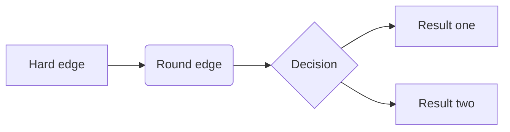

# Lane Following using Pure Pursuit Control
Emulie Chhor, Kumaraditya Gupta
2025-12-23

## Introduction

Add intro here. Here is some text. Quarto allows you to put things in
the margins.

<span class="column-margin margin-aside">This is a side note that will
appear in the right margin.</span>



## Trajectory Generation

Add info about trajectory generation

We can place images or charts that span the full width or sit in the
margin.

<div class="column-margin">


</div>

### Code Block

Because we enabled code folding, this big block won’t clutter the page
unless the user clicks “Show Code”.

``` python
import numpy as np

a = 1
b = 2
multiple = a * b

# Complex plotting code...
```

## Pure Pursuit Control

Add information about pure pursuit here. With some figures maybe.

## Results

Add result videos to this section.

## Testing

Steps to reproduce our results.

Clone the project GitHub repository

``` bash
git clone git@github.com:kumaradityag/fp-control
```

## Conclusion

Add info about what we learnt and how to move forward.
